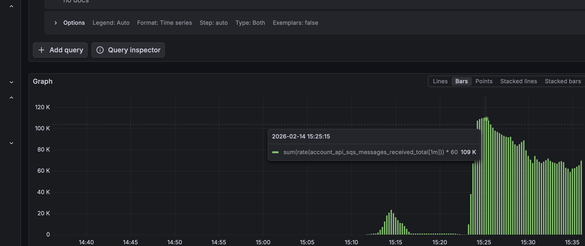

# 📦 Account API – Event-Driven Financial Service

## 🎯 Objetivo

Este projeto implementa uma **API orientada a eventos** para processamento de transações financeiras via **Amazon SQS**, com persistência em **MySQL** e execução local completa com **LocalStack**.

Além da API principal, o projeto inclui um **gerador de carga (simulatortransaction)** para testes de throughput e estresse da fila SQS.

O foco é garantir:

* **Desacoplamento** (event-driven)
* **Resiliência** no consumo de mensagens
* **Observabilidade** (métricas e logs centralizados)
* **Arquitetura hexagonal (Ports & Adapters)**
* **Testes de performance controlados**

---

## 🏗️ Arquitetura da Solução

### Stack Principal

* **Spring Boot 4.x**
* **Kotlin + JDK 21 (LTS)**
* **MySQL**
* **Amazon SQS**
* **LocalStack**
* **Docker Compose (orquestrado pelo setup.sh)**
* **Prometheus + Grafana**
* **Loki + Promtail**

---

## 🔄 Fluxo de Processamento

### 1️⃣ Processamento de Transação (Assíncrono)

1. Um evento é publicado na fila **SQS** (`transactions-queue`)
2. O **SQS Listener (adapter in)** consome a mensagem
3. Um **handler** transforma o payload em um comando para a aplicação
4. O **use case** processa regras e persiste alterações no **MySQL**
5. Logs e métricas ficam disponíveis na stack de observabilidade

---

## 🚀 SimulatorTransaction – Gerador de Eventos

O projeto inclui um segundo serviço:

### 🎯 Objetivo

Gerar **grandes volumes de eventos SQS** para:

* Testar throughput
* Validar resiliência
* Medir processamento por minuto
* Validar métricas Prometheus

### 📦 Stack

* Spring Boot 4.x
* Kotlin + JDK 21
* AWS SDK v2 (SQS)
* Execução via Docker Compose

---

### 🔄 Funcionamento

1. Usuário chama endpoint REST do simulator
2. Serviço gera payloads aleatórios (transaction + account)
3. Publica mensagens em batch (até 10 por request)
4. Controla taxa de envio (ex: 10.000 mensagens/minuto)

---

### ▶️ Endpoint do Simulator

Criamos um simulador para realização de um teste de alta carga. 

Realizando esses testes percebemos que para os requisitos solicitado  no testes (2 mil tps) não precisamos fazer ajustes finos de consumo do sqs nem utilizar outras coroutines do Kotlin para mais perfomance. 

Caso venha a ser necessário basta executar mais de uma instancia do account-api, porém hoje só estamos executando 1 que está executando mais de 150 mil transações por minuto como mostra na imagem abaixo. 




Iniciado automaticamente via `setup.sh`.

Base URL:

```
http://localhost:8099
```

### Iniciar simulação

```bash
curl -X POST http://localhost:8099/simulator/transactions/start \
  -H "Content-Type: application/json" \
  -d '{"totalMessages": 150000,"ratePerMinute": 150000,"parallelism": 12}'
```

Parâmetros:

| Campo           | Descrição                            |
| --------------- | ------------------------------------ |
| `totalMessages` | Quantidade total de eventos a enviar |
| `ratePerMinute` | Taxa por minuto           |
| `parallelism`   | Nível de concorrência     |

---

## 📊 Monitoramento de Throughput

Exemplo de query no Grafana (Prometheus):

```promql
sum(rate(account_api_sqs_messages_success_total[1m])) * 60
```

Essa métrica permite visualizar **eventos processados por minuto**.

---

## ▶️ Execução com setup.sh

O projeto completo (infra + API + simulator) é iniciado via:

```bash
chmod +x infra/setup.sh
./infra/setup.sh
```

O script:

* Derruba stack antiga
* Sobe MySQL, LocalStack, account-api e simulatortransaction
* Configura fila + DLQ
* Inicializa observabilidade

---

## 🧪 Envio manual de evento (alternativa)

Caso queira testar sem o simulator:

```bash
chmod +x send-transaction.sh
./send-transaction.sh
```

---

## 📘 Swagger

### Account API

* `http://localhost:8080/swagger`
* `http://localhost:8080/openapi`

### SimulatorTransaction

* `http://localhost:8099/swagger-ui/index.html`
* `http://localhost:8099/v3/api-docs`


### Prometheus
* métricas raw `http://localhost:8080/actuator/prometheus`
* Prometheus	`http://localhost:9090`

### Grafana
* Grafana	http://localhost:3000
---
O Grafana já sobe integrado com a prometheus, então basta executar a query fornecida 
___

```sum(rate(account_api_sqs_messages_received_total[1m])) * 60```
___

```sum(rate(account_api_sqs_messages_success_total[1m])) * 60```
---

## 📈 Próximos Passos

### Observabilidade

* Dashboards dedicados para throughput
* Métricas de latência por processamento
* Alertas para DLQ

### Performance

* Ajustes de batch size
* Ajustes de paralelismo
* Tuning do client HTTP do AWS SDK

### Resiliência

* Idempotência por `transaction.id`
* Monitoramento de DLQ
* Retry/backoff controlado

---

## 📌 Conclusão

A solução agora conta com dois serviços:

### 🔹 account-api

Responsável pelo processamento real das transações.

### 🔹 simulatortransaction

Responsável por gerar carga controlada e validar comportamento sob estresse.

O ambiente é:

* Totalmente dockerizado
* Reproduzível via `setup.sh`
* Observável via Prometheus + Grafana
* Preparado para testes de performance e evolução futura

---
